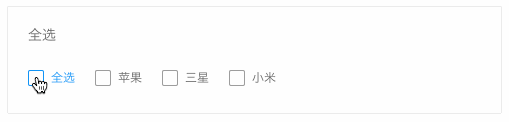
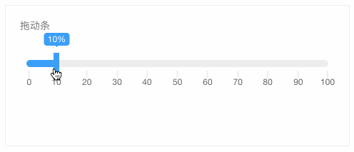
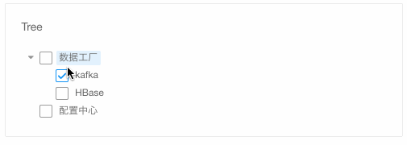
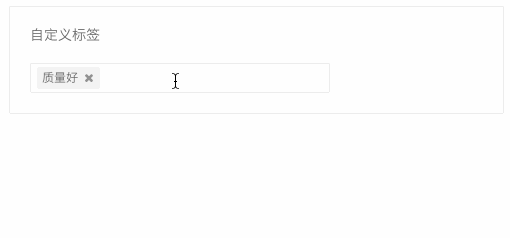
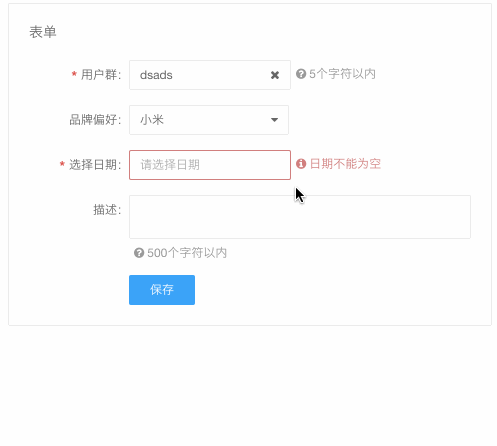
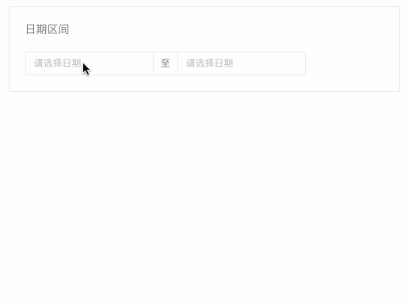
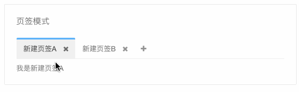

# BFD UI

[](https://travis-ci.org/baifendian/bfd-ui)
[](http://badge.fury.io/js/bfd-ui)
[](https://npmjs.org/package/bfd-ui)

企业级前端整体解决方案 [http://ui.baifendian.com](http://ui.baifendian.com)









## 安装

```sh
npm install bfd-ui --save
```

## 使用

以日期组件为例

```jsx
import DatePicker from 'bfd-ui/lib/DatePicker'

ReactDOM.render(<DatePicker />, mountNode)
```

## 脚手架

`bfd-ui` 基于 `react`、`webpack` 等技术，如果你本地没有相关的环境配置，强烈建议基于脚手架直接上手开发
[generator-bfd](https://github.com/baifendian/generator-bfd)


## 更新日志

[CHANGELOG](CHANGELOG.md)


## 参与开发

### 安装开发环境

点击右上角 Fork

```sh
git clone https://github.com/yourName/bfd-ui.git

# DEMO 站集成了脚手架项目的说明，所以需要依赖这个项目的一些资源，与 bfd-ui clone 在同一目录下即可
git clone https://github.com/baifendian/generator-bfd.git

cd bfd-ui

npm install

npm start
```

查看: http://localhost:4001


### 编写一个新组件

```sh
npm run create MyComponent
```

查看: http://localhost:4001/components/MyComponent


### 开发规范

- 向下兼容
- 单元测试：组件根目录下创建 `__tests__` 文件夹
- 代码规范参考 [airbnb react](https://github.com/airbnb/javascript/tree/master/react)


### 提交代码

push 后发起 pull request 即可
