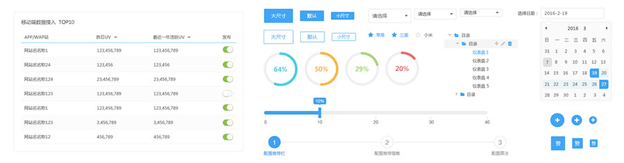

# BFD UI

[](https://travis-ci.org/baifendian/bfd-ui)
[](https://www.npmjs.org/package/bfd-ui) 
[](https://npmjs.org/package/bfd-ui)

企业级前端整体解决方案 [http://ui.baifendian.com](http://ui.baifendian.com)



## 安装

```sh
npm install bfd-ui --save
```

## 使用

```jsx
import DatePicker from 'bfd-ui/lib/DatePicker'

ReactDOM.render(<DatePicker />, mountNode)
```

## 贡献代码

### 安装开发环境

```sh 
git clone https://github.com/baifendian/bfd-ui.git

# 脚手架文档与 bfd-ui 集成，所以依赖 generator-bfd 项目里的部分文件，与 bfd-ui clone 在同一目录下
git clone https://github.com/baifendian/generator-bfd.git

cd bfd-ui

npm install

npm start
```

查看: http://localhost:4001


### 编写一个新组件

```sh
npm run create MyComponent
```

查看: http://localhost:4001/components/MyComponent


### 开发规范

1. 向下兼容

1. 单元测试：组件根目录下创建 `__tests__` 文件夹

1. 代码规范参考 [airbnb react](https://github.com/airbnb/javascript/tree/master/react)


### 更新日志

[CHANGELOG](CHANGELOG.md)


### 脚手架

[generator-bfd](https://github.com/baifendian/generator-bfd)